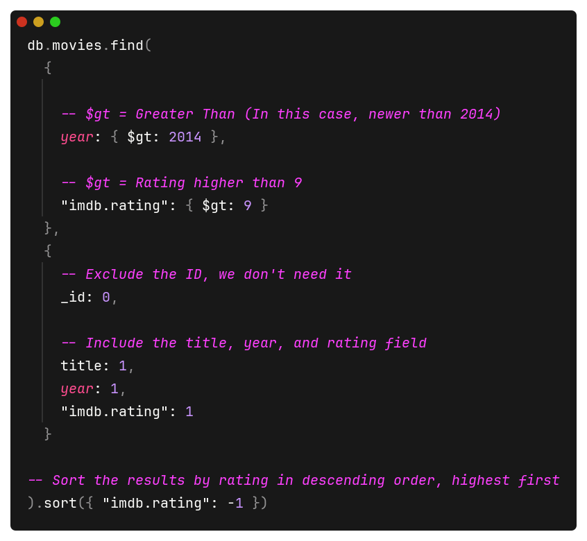
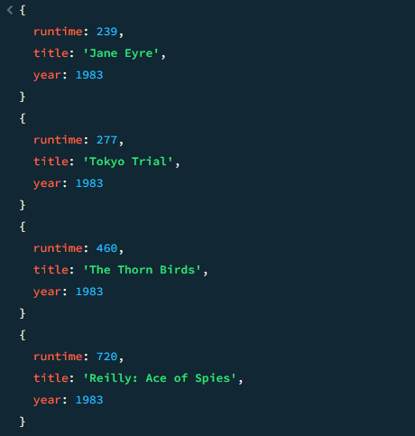
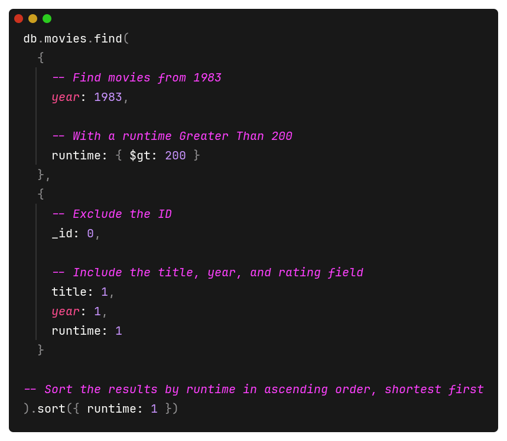
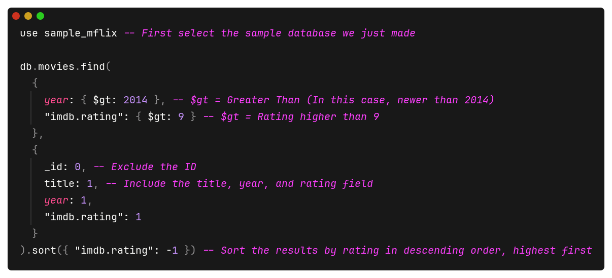

# Topics in CS: Spring 2025
### Assignment 3: MongoDB

To properly show the results of my queries, I've included not only the screenshots with the actual queries, but the comments for the queries as well included in each photo.
In order to properly select the test database, the following line must be used in the MongoDB shell:

>```> use sample_mflix```

## Query 1
###### *"Find all movies with runtime greater than 200 minutes in year 1983. The result should include a list of objects sorted by runtime increasing, and each object only has three fields: runtime, title, year."*



## Query 2
###### *"Find all movies after year 2014 with imdb rating greater than 9."*


